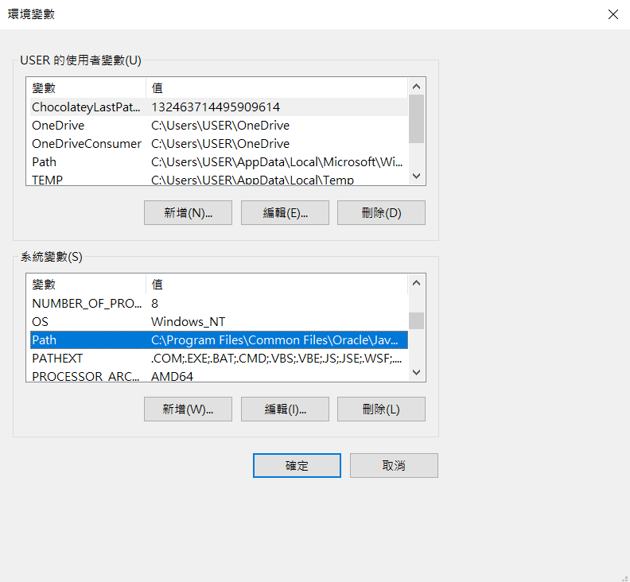
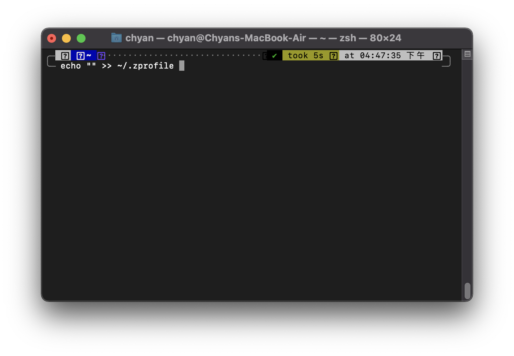

# [Day02] CH01：工欲善其事，必先利其器——開發環境安裝

又來到學習 Java 的時間了，程式是怎麼產生的呢？簡單來說如下所示：

    原始碼（Source code）->編譯器（Compiler）->機器碼（Machine code）

只要我們寫出該程式語言的編譯器能看懂的格式，編譯器就會幫你處理好並打包成執行檔。在開始寫程式之前，需要準備好執行和撰寫 Java 所需的環境和軟體。

* ## 執行環境

    會依照作業系統分成 Windows 和 MacOS 的安裝教學

    * ### Windows

        到[官網](https://www.oracle.com/java/technologies/javase-jdk16-downloads.html)下載 JDK16，點選 jdk-16.0.2_windows-x64_bin.exe（以下附圖為 16.0.1）：

        執行檔案，一直按「下一步」，記得儲存的檔案路徑！等等要使用到。

        

        安裝完後，搜尋「環境變數」，點選「編輯系統環境變數」

        

        點選「環境變數」

        

        快點兩下「Path」

        

        找到剛剛下載的資料夾，找到 bin 的資料夾，複製路徑

        

        把路徑新增到環境變數，並狂按確定

        

        搜尋「cmd」，打開這個可以裝 B 的黑色視窗

        

        輸入「javac」，有一堆東西跳出來表示你成功了！

        

    * ### MacOS

        到[官網](https://www.oracle.com/java/technologies/javase-jdk16-downloads.html)下載 JDK16，點選 jdk-16.0.2_osx-x64_bin.dmg（以下附圖為 16.0.1）：

        執行檔案，瘋狂按「繼續」

        
        
        安裝完後，按下 command + 空白鍵，輸入 terminal，打開終端機

        

        輸入「echo “” >> ~/.zprofile」（若是沒有 zprofile，可以試試看 bash_profile）

        

        輸入「open ~/.zprofile」

        

        依序輸入以下指令，完成後儲存

            export JAVA_HOME=/Library/Java/JavaVirtualMachines/jdk-16.0.2.jdk/Contents/Home

            export PATH=$JAVA_HOME/bin:$PATH

            export CLASSPATH=.:$JAVA_HOME/lib/dt.jar:$JAVA_HOME/lib/tools.jar

        

        輸入「source ~/.zprofile」

        

        輸入「javac」，有一堆東西跳出來表示你成功了！

        

* ## IDE安裝

    IDE（Integrated Development Environment），中文稱作整合開發環境，是用來輔助開發電腦程式的應用軟體。

    這次的教學是使用 Visual Studio Code（VScode），為什麼要使用 IDE 呢？寫程式需要一個文字編輯器來撰寫，你可以使用最傳統的記事本寫程式 XD，但是有更方便的工具為什麼不用呢？

    首先到[這個網站](https://code.visualstudio.com/download)依照你的作業系統點選下載，接著一直點選「下一步」，完成後打開軟體可以看到這個畫面，點選「Extensions」（四個正方形）

    

    搜尋「java extension pack」，安裝好後重新開啟 VScode

    

    點選左上角 File，選擇 Open Folder，開啟你的資料夾，在左手邊新增 HelloWorld.java，開始你的第一支程式（照傳統當然是 Hello world 啦！）照著上面的程式碼打完後，按「Ctrl + \`」，開啟 terminal，輸入「javac + 檔名」，編譯程式，再輸入「java + 檔名」，執行程式

    

 

完成你的第一支程式，是不是很有成就感呢？那麼我們明天見囉~
