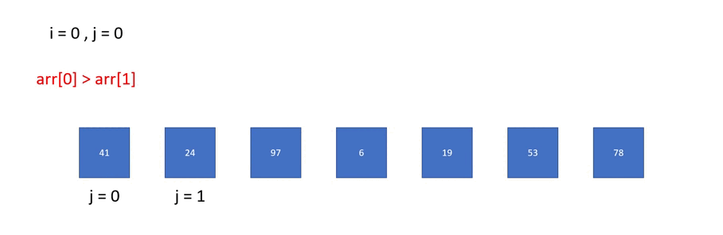

# [Day15] CH10：排序大家族——氣泡排序法

在「排序大家族」這個主題，會介紹幾種常見的排序，也會簡單分析他們的特性和演算法，第一天登場的是氣泡排序法（Bubble Sort）。

昨天在二元搜尋前，要給定已排序好的陣列，那要怎麼排序呢？就像我們在玩撲克牌時，需要將牌按照大小排列一樣。

## 氣泡排序法

又稱泡沫排序法，顧名思義就是像泡泡一樣，越大的泡泡會越往上飄，藉此完成排序。由未排序的第一筆資料開始，若前面大於後面資料則倆倆交換位置，直到所有資料皆已由小至大排序。

給定一個陣列：

    41, 24, 97,  6, 19, 53, 78

一開始，41 和 24 比大小，大的會往後放，41 > 24 所以兩者需要交換位置。

    24, 41, 97,  6, 19, 53, 78

接下來，比較 41 與 97，97 較大，所以不用交換。再來比較 97 和 6，97 > 6，兩者交換。

    24, 41,  6, 97, 19, 53, 78

一直持續這樣直到最後 97 和 48 最後一次交換，此時 97 就會交換至最後一個，也就是此陣列最大的數字。

    24, 41,  6, 19, 53, 78, 97

第一輪結束後，可以排序好一個數字，接下來又回到頭開始比較，所以我們需要 n-1 輪（因為第 n-1 輪結束剩下最後一個未排序的數字，也就是最小的數字了！），才可以將整個陣列由小至大排序，以下動圖可以和程式碼一起服用：



```java
public class BubbleSort {
    public static void main(String[] argvs){
        int[] arr = {41, 24, 97, 6, 19, 53, 78};
        int n = arr.length;
        for(int i = 0 ; i < n-1 ; i++){
            for(int j = 0 ; j < n-i-1 ; j++){
                if(arr[j] > arr[j+1]){  //兩數字交換
                    int t = arr[j+1];
                    arr[j+1] = arr[j];
                    arr[j] = t;
                }
            }
        }
        for(int i = 0 ; i < n ; i++){
            System.out.printf("%d ", arr[i]);
        }
    }
}
```

<br>

在演算法中，我們經常討論的是「時間複雜度」和「空間複雜度」，這個教學主要會介紹時間複雜度，在昨天已經有提到了，但還沒正式介紹。

### 時間複雜度

可以定性描述演算法執行的時間，通常使用大 O 表示。簡單來看，假設有 n 筆輸入，最多需要 2n<sup>3</sup> + 5n，則時間複雜度就是 O(n<sup>3</sup>)。

通常我們會看在最好、平均、最壞的三個情況下的時間複雜度。由氣泡排序法來看，最好的情況就是一開始就由小到大排列，則時間複雜度為 O(1)。平均的情況是第 n 筆資料，會比較 (n-1) / 2 次，時間複雜度為 O(n<sup>2</sup>)。最壞的情況是一開始由大排到小，總共需要執行 n(n-1) / 2 次，時間複雜度為 O(n<sup>2</sup>)。

<br>

如果以上的演算法概念不是很懂不要緊，但是排序的原理和寫法一定要搞懂哦。排序還可以怎麼排呢？大家可以想想看！