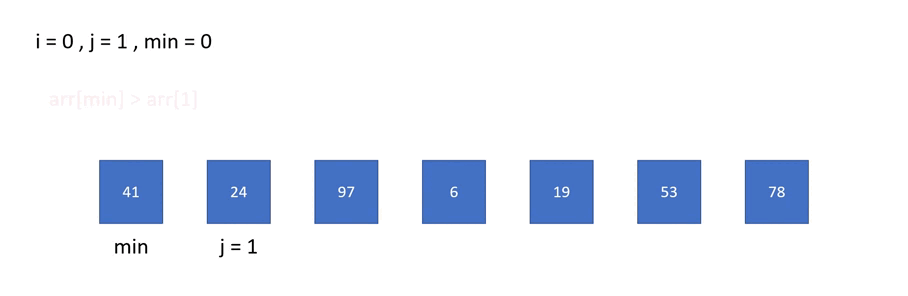

# [Day16] CH10：排序大家族——選擇排序法

今天介紹的是第二種排序法是選擇排序法（Selection Sort）。

## 選擇排序法

將資料分成已排序與未排序，由未排序資料中找最小值，放入已排序資料最末端。由此可知，每一次我們有兩件事要做，一是找到當前的最小值，二是把它放到已排序的最末端。

給定一個陣列：

    41, 24, 97,  6, 19, 53, 78

一開始從未排序的 41 到 78 之間選出最小值 6，和最前面的 41 換位子。

     6, 24, 97, 41, 19, 53, 78

接下來從未排序的 24 到 78 中選出最小值 19，和 24 換位置。

     6, 19, 97, 41, 24, 53, 78

再來從未排序的 97 到 78 中間選出最小值 24，和 97 換位置。

     6, 19, 24, 41, 97, 53, 78

一直持續到最後兩個數字交換完位子，便完成由小至大的排序，以下是動圖與程式碼：



```java
public class SelectionSort {
    public static void main(String[] args){
        int[] arr = {41, 24, 97, 6, 19, 53, 78};
        int n = arr.length;
        for(int i = 0 ; i < n-1 ; i++){
            int min = i;
            for(int j = i+1 ; j < n ; j++){
                if(arr[min] > arr[j]){  //找最小值
                    min = j;
                }
            }
            int t = arr[i]; //兩數交換
            arr[i] = arr[min];
            arr[min] = t;
        }
        for(int i = 0 ; i < n ; i++){
            System.out.printf("%d ", arr[i]);
        }
    }
}
```

<br>

### 時間複雜度

* #### 找到最小值

    首先要從 n 個未排序數字中找到最小值，需要 n 個步驟。

    最常見找最小值的方法：先設陣列的第一個數字是「目前的最小值」，再把陣列後面的數值一一讀取。如果讀取的數字比目前的最小值大，就不動。否則把目前的最小值換成這個數。重複這個方法把所有陣列裡的數都讀過一遍，就能找到整個數列的最小值。

    從上面的例子來看，第一次要從 7 個數中找到最小值，需要 7 個步驟，第二次 6 個...，直到最後一次 1 個，總共是 (n + (n - 1) + ... + 1) = n * (n + 1) / 2

* #### 放到最左邊

    每次找到最小值，就和最左邊的數倆倆交換，總共需要交換 n 次，共 n 個步驟。

兩者加起來為 n * (n + 1) / 2 + n，所以時間複雜度為 O(n<sup>2</sup>)，不管是最差、平均或最好都一樣，因為每次都需要做所有的步驟。

<br>

今天的時間複雜度和昨天一樣ㄟ，那哪一個比較快呢？明天會不會更快呢？讓我們繼續看下去