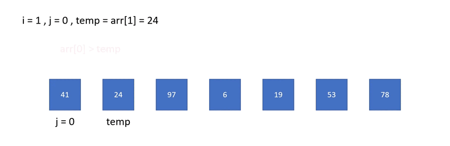

# [Day17] CH10：排序大家族——插入排序法

今天第三天要登場的是插入排序法（Insertion Sort），我自己在玩撲克牌的時候，都是使用這種排序，不知道你們是不是也是呢？

## 插入排序法

將資料分成已排序與未排序，由未排序的第一筆資料開始，插入到已排序資料的適當位置，插入時由後至前比較，直到遇到比當前資料 (temp) 小的值再插入，比較時若遇到比 temp 大或相等，則往後移。

給定一個陣列：

    41, 24, 97,  6, 19, 53, 78

首先，24 比 41 小插入到 41 前

    24, 41, 97,  6, 19, 53, 78

接下來 97 比 41 大，插入 41 後面

    24, 41, 97,  6, 19, 53, 78

再來，6 比 24 小，插入到 24 前

     6, 24, 41, 97, 19, 53, 78

以此類推，最後 78 插入完就完成排序，以下是動圖與程式法：



```java
public class InsertionSort {
    public static void main(String[] args){
        int[] arr = {41, 24, 97, 6, 19, 53, 78};
        int n = arr.length;
        for(int i = 1 ; i < n ; i++){
            int temp = arr[i];
            int j = i-1;
            while(j >= 0 && arr[j] > temp){ //持續比對是否比 temp 大
                arr[j+1] = arr[j];
                j--;
            }
            arr[j+1] = temp;
        }
        for(int i = 0 ; i < n ; i++){
            System.out.printf("%d ", arr[i]);
        }
    }
}
```

### 時間複雜度

在最佳的情況下，也就是一開始便由小到大排序，因此只需走過陣列長度的次數，每一次只需 1 個步驟（都不需移動），時間複雜度為 O(n)。而在最壞的情況，陣列一開始由大到小排序，每一次需要 i 個步驟，總共會需要和選擇排序法一樣的 n * (n + 3) / 2，時間複雜度為 O(n<sup>2</sup>)。平均的話，每一次會需要比較 n / 2 個數字，總共 n 次，所以時間複雜度一樣為 O(n<sup>2</sup>)。

<br>

學了3天那我們先來整理一下三個排序法吧：

|演算法|Best Case|Worst Case|Average Case|
|:-:|:-:|:-:|:-:|
|氣泡排序法|O(n)|O(n<sup>2</sup>)|O(n<sup>2</sup>)|
|選擇排序法|O(n<sup>2</sup>)|O(n<sup>2</sup>)|O(n<sup>2</sup>)|
|插入排序法|O(n)|O(n<sup>2</sup>)|O(n<sup>2</sup>)|

怎麼平均都是 O(n<sup>2</sup>) 呢？難道不能再快一點嗎？明天我們會介紹這個單元的最後一個演算法，一起來期待看看吧！