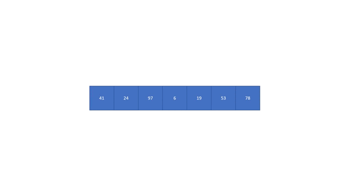

# [Day18] CH10：排序大家族——合併排序法

今天要介紹的是我們學的最後一個排序法——合併排序法。

## 合併排序法

分成切割與合併兩個部分：

* 切割

    將數列對分成左子數列、右子數列。分別對左子數列、右子數列做前一個步驟（遞迴 Recursive）。
    
    直到左子數列、右子數列被分割成只剩一個元素為止，將僅剩的一個元素作為遞迴的結果回傳，對回傳的左子數列、右子數列依大小排列合併，將合併的結果作為遞迴的結果回傳。

* 合併

    將左子數列及右子數列依大小合併成一個新的數列（需執行 ⌈log 2n⌉ 回合）：

    1. 若左子數列的數值都已填到新的數列，將右子數列中未填過的最小值填入新數列
    2. 若右子數列的數值都已填到新的數列，將左子數列中未填過的最小值填入新數列
    3. 將左子數列及右子數列中，未填過的最小值填到新的數列


給定一個陣列：

    41, 24, 97,  6, 19, 53, 78

首先先將陣列拆成左子陣列與右子陣列

    41, 24, 97,  6       19, 53, 78

持續遞迴將左子陣列與右子陣列繼續切割，直到都只剩下一個數字

    41, 24       97,  6       19, 53, 78

    41, 24       97,  6       19, 53       78

    41       24       97,  6       19, 53       78

    41       24       97        6       19, 53       78

    41       24       97        6       19       53       78

接下來將各陣列合併：最小值先填入

    24, 41       97        6       19       53       78

    24, 41        6, 97       19       53       78

    24, 41        6, 97       19, 53       78

     6, 24, 41, 97       19, 53       78

     6, 24, 41, 97       19, 53, 78

     6, 19, 24, 41, 53, 78, 97

以上的範例大家可能有看沒有懂，那就來看看動圖和程式碼吧：



```java
public class MergeSort{
    public static void main(String[] args){
        int[] arr = {41, 24, 97, 6, 19, 53, 78};
        int n = arr.length;
        mergesort(arr, 0, n - 1);
        for(int i = 0 ; i < n ; i++){
            System.out.printf("%d ", arr[i]);
        }
    }

    public static void merge(int[] arr, int head, int mid, int tail){
        int lenA = mid - head + 1;
        int lenB = tail - (mid+1) + 1;
        int[] A = new int[lenA];    //左子數列
        int[] B = new int[lenB];    //右子數列
        int i,j;
        for(i = 0 ; i < lenA ; i++){
            A[i] = arr[head+i];
        }
        for(j = 0 ; j < lenB ; j++){
            B[j] = arr[mid+1+j];
        }
        i = 0;
        j = 0;
        int k = head;
        while(i < lenA && j < lenB){
            if(A[i] < B[j]){
                arr[k] = A[i];
                i++;
                k++;
            }
            else{
                arr[k] = B[j];
                j++;
                k++;
            }
        }
        //右子數列已經結束，將左子數列剩餘的數複製到 arr
        while(i < lenA){
            arr[k] = A[i];
            i++;
            k++;
        }
        //左子數列已經結束，將右子數列剩餘的數複製到 arr
        while(j < lenB){
            arr[k] = B[j];
            j++;
            k++;
        }
    }

    public static void mergesort(int[] arr, int head, int tail){
        if(head < tail){
            int mid = (head + tail) / 2;
            mergesort(arr, head, mid);
            mergesort(arr, mid+1, tail);
            merge(arr, head, mid, tail);    //合併
        }
    }
}
```

### 時間複雜度

* 切割

    把陣列長度為 n 的切成 n 等分需要 n - 1 刀（步驟）。

* 合併

    合併 n 個數字時，需要 n 個步驟，而每次切成一半，總共的回合術是需要以 2為底的 logn 次。

總共需要的步驟為 n - 1 + nlogn，所以時間複雜度為 O(nlogn)。

<br>

今天的排序法用到比較進階的「遞迴」觀念，因為演算法這部分在這個教學沒有時間詳細介紹，所以大家就盡量吸收。

有沒有發現比前三天的還要快一點，那還能更快嗎？答案是一般需要兩兩比較的排序法最快只能到這樣了，要更快的話就需要用到其他更進階的概念了。

對排序有興趣的人，可以自行 google 快速排序法、堆積排序法、計數排序法等。

若你有照著程式碼一行一行編寫、理解，經過這四天相信你已經對陣列非常熟悉，也已經和 18 天前的你不一樣了！