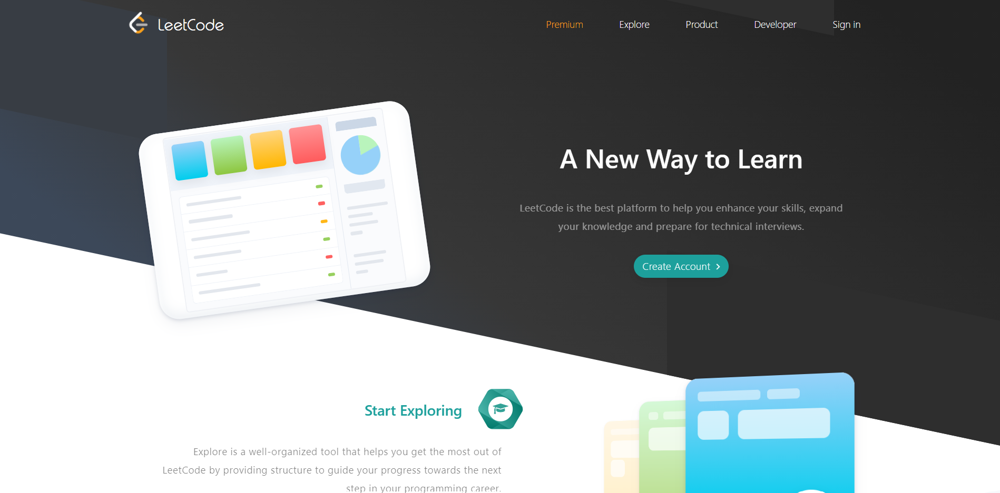
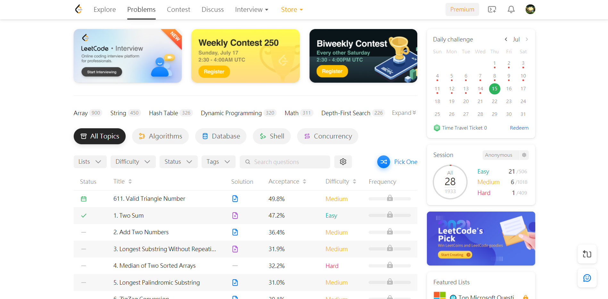
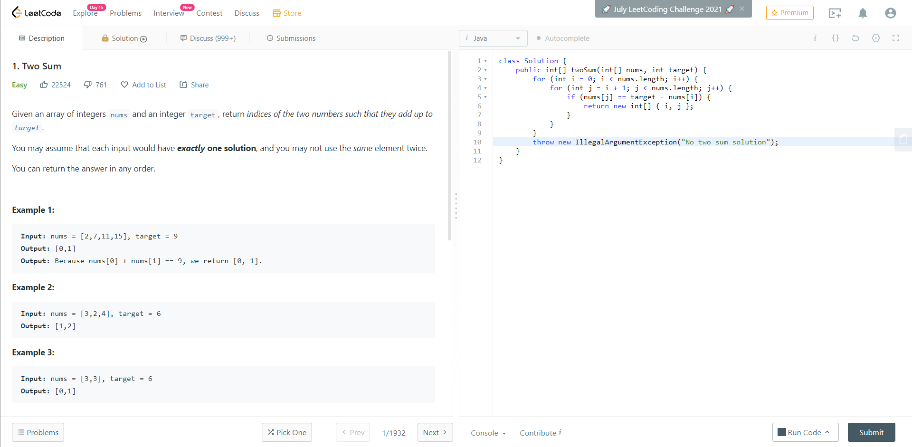
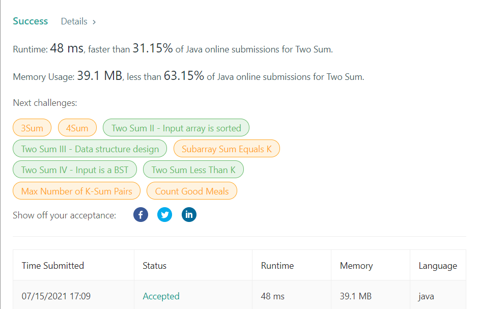
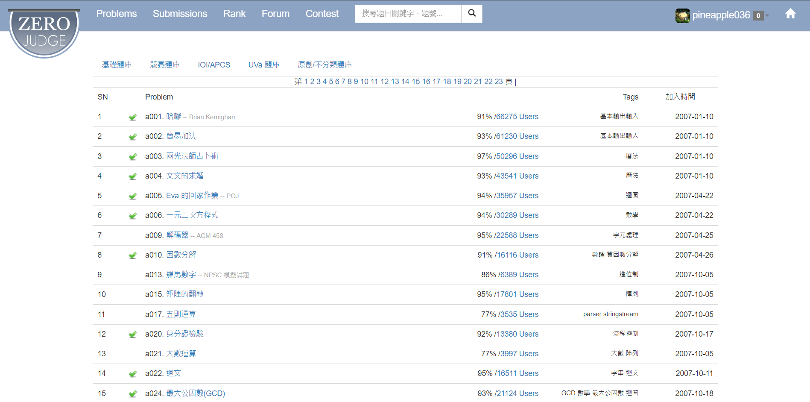

# [Day20] 來決鬥吧——ZeroJudge & LeetCode 解題

想要快速變成強者嗎？最基礎的練習方式就是解題。在解題的過程中，會訓練邏輯思考能力，同時也會增加對程式語言的熟悉度。在此要介紹兩個練習網站： ZeroJude 高中生程式解題系統和 LeetCode。

許多公司在面試時，都會查看 LeetCode 的解題數，很多白板題也是從題庫中出來的，可以想見解題可以用來判斷一個人在程式的能力。LeetCode 是全英文介面，題目也都是英文，因此對初學者來說有一定的難度。



創建完帳號後，點選左上角的 Problems，就可以看到題目列表



此頁面會提供題目的正答率與難易度，可以依據自行喜好選擇要撰寫之題目，以下以第一題當作範例：

左手邊是題目敘述，右手邊是程式法撰寫，撰寫完成後可以點選右下角執行測試，完成後就可以按下旁邊的按鈕上傳



上傳後若是答對就可以查看執行速度和記憶體使用率和與其他使用者相比下的比率。



在線上解題時，有一些常見的術語，可以得知解題情況：

|簡寫|全稱|中文稱謂|
|:-:|:-:|:-:|
|AC|Accepted|通過|
|WA|Wrong Answer|答案錯誤|
|TLE|Time Limit Exceed|超時|
|OLE|Output Limit Exceed|超過輸出限制|
|MLE|Memory Limit Exceed|超過記憶體|
|RE|Runtime Error|執行時錯誤|
|PE|Presentation Error|格式錯誤|
|CE|Compile Error|無法編譯|

雖然 LeetCode 是許多企業認證的解題網站，但對初學者來說門檻頗高，所以建議大家可以從 ZeroJudge 高中生程式解題系統入門，介面是中文，和 LeetCode 差異不大，比較特別的是在題目列有 Tag 顯示該題目的考點，所以在選擇題目上可能較為方便，除此之外也有多種題庫可供選擇。



<br><br>

那今天就帶大家來寫題目吧！

>### 基礎題庫 a010 因數分解
```java
import java.util.Scanner;
public class ZeroJudge{
    public static void main(String[] args){
        Scanner sc = new Scanner(System.in);
        int num = sc.nextInt();
        int count;
        for(int i = 2; i <= num ; i++){
            count = 0;
            while(num % i == 0){
                num /= i;
                count++;
            }
            if(count > 1){
                System.out.print(i + "^" + count);
                if(num != 1){
                    System.out.print(" * ");
                }
            }
            else if(count == 1){
                System.out.print(i);
                if(num != 1){
                    System.out.print(" * ");
                }
            }
        }
        sc.close();
    }
}
```
<br>

>### 基礎題庫 a740 質因數之和
>解題思路：先用質數判斷是否可整除，再將所有可整除數相加。

<br>

這題與上題類似，大家可以回家自行練習看看，還有許多題目都可以多加練習，若是每天花個一小時，不用多久你就可以超越我了！